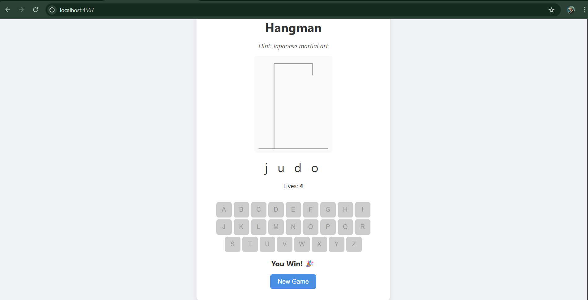
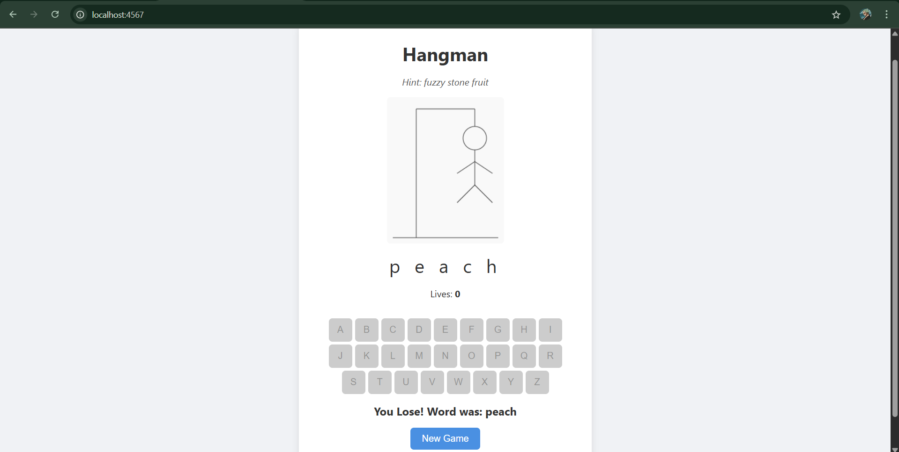

# Hangman Game - Sinatra Web App

This is a web-based Hangman game built with **Ruby (Sinatra)** on the backend and **HTML, CSS, JavaScript** on the frontend. The game includes audio feedback, canvas drawing for the hangman, and interactive UI elements.

## 🛠 Tech Stack

* **Backend**: Ruby, Sinatra
* **Frontend**: HTML, CSS, JavaScript (Vanilla)
* **Audio**: Sound effects for background music, wrong guesses, and winning
* **Canvas API**: For drawing the Hangman character step-by-step

## 📁 Folder Structure

```
public/
├── audio/
│   ├── bg.mp3
│   ├── win.mp3
│   └── wrong.mp3
├── index.html
├── script.js
├── style.css
config.ru
Gemfile
server.rb
words.txt
```

## 📜 Features

* 🎮 Random word selection with hints
* 🎨 Dynamic canvas drawing for each wrong guess
* 🔉 Audio effects: background music, win, and lose sounds
* 💡 Hint provided for each word
* 🔄 Reset button to start a new game instantly

## 🚀 Getting Started

### Prerequisites

* Ruby installed
* Bundler installed (`gem install bundler`)

### Installation

1. **Clone the repository**

```bash
git clone https://github.com/your-username/hangman-sinatra.git
cd hangman-sinatra
```

2. **Install dependencies**

```bash
bundle install
```

3. **Run the application**

```bash
ruby server.rb
```

Or using Rack:

```bash
rackup
```

4. **Visit the application**
   Open your browser and go to: [http://localhost:4567](http://localhost:4567)

## 📝 words.txt Format

The `words.txt` file contains words and their hints separated by a pipe `|`:

```
ruby|A popular programming language
hangman|Classic guessing game
sinatra|A Ruby web framework
```

## 📸 Screenshots

### ✅ Correct Guess



### ❌ Wrong Guess



## 📦 Deployment

This project can be easily deployed to platforms like **Heroku**, **Render**, or **Fly.io**. Make sure to include a `Procfile` if using Heroku.

## ✨ Future Enhancements

* Keyboard input support
* High score tracking
* User authentication
* Word difficulty levels
* Mobile responsiveness

## 🙌 Acknowledgements

* [Sinatra](https://sinatrarb.com/)
* [MDN Canvas API](https://developer.mozilla.org/en-US/docs/Web/API/Canvas_API)
* [FreeSound](https://freesound.org/) for audio clips (if applicable)

## 📄 License

This project is open source and available under the [MIT License](LICENSE).

---

> Made with ❤️ by \ shashi – Feel free to fork, contribute, and suggest features!
